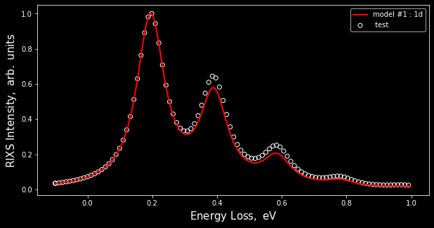

Quick start
===========

First things first


```python
import phlab
```

Now let's create our workspace, which is a wrapper for all the experiments and models:


```python
workspace = phlab.rixs()
```

One of the main objects is a model. You can create any number of models and fit them to the experiment.
Here were are starting with a single harmonic oscillator model. Check `./model_name/` for input and output files.


```python
model = workspace.model_single_osc(name = '1d')
```

    creating model : /Users/lusigeondzian/github/phlab/examples/01_example/1d
    /Users/lusigeondzian/github/phlab/examples/01_example/1d/_input/
    no input found
    creating new input
    warning : please check new input
    number of models : 1


Input by default is reading from `./model_name/_inputs/input_model_{nm}.json` and is an attribute of the model


```python
model.input
```


    {'problem_type': 'rixs',
     'model': '1d',
     'method': 'fc',
     'vib_space': 1,
     'coupling': 0.1,
     'omega_ph': 0.195,
     'nf': 10.0,
     'nm': 100.0,
     'energy_ex': 10.0,
     'omega_in': 10.0,
     'gamma': 0.105,
     'gamma_ph': 0.05,
     'alpha_exp': 0.01}


If you wish to alter the input inside your code, call the parameter you want to overwrite. (Note: when you will execute the model  `model.run()` the input file will be overwritten)


```python
model.input['coupling'] = 0.15
model.color = 'r'
```


```python
model.run()
```

If you want to add an experiment, you have to specify the path to file with experimental data.


```python
exp = workspace.experiment(file = 'test_data.csv', name= ' test')
```

To visualize everything you can create vitem and list all models and experiment objects that you would like to compare. Feel free to use matplotlib library's methods to customize resulting figure.


```python
vitem = workspace.visual(model_list = [model], exp = exp)
```

Note: `scale = 0`  would normalizes everything by the maximum of intensity.


```python
vitem.show(scale = 0)
```



