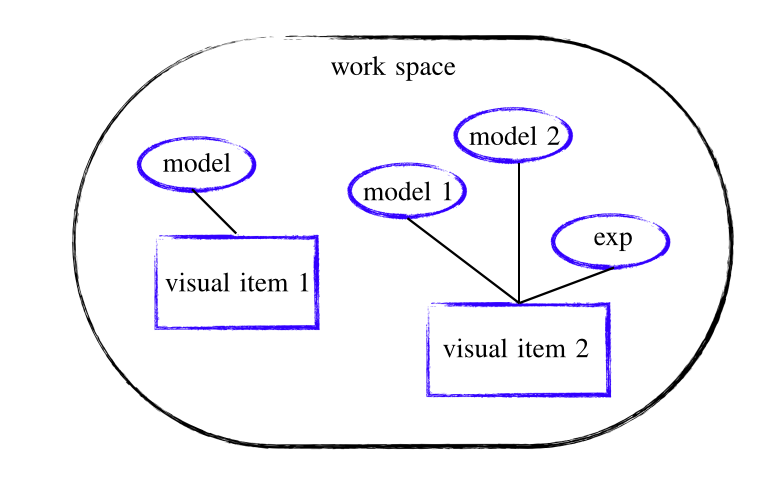

Concept sketch
===========

Simple sketch to visualize different objects of the package. Briefly, within your 'workspace'  you can create various combinations of models and experiments and use the visual method to show results.
